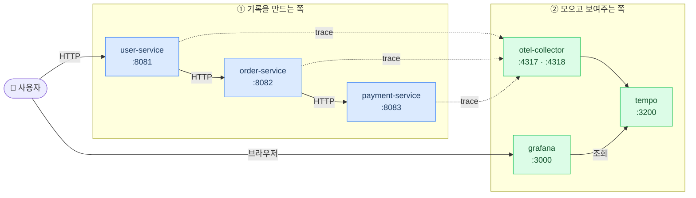
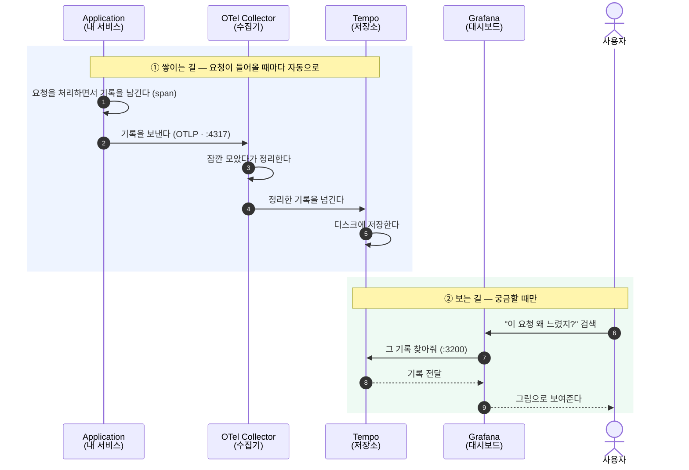

# lecture_otel

앱이 기록을 만들고 → Collector가 모아서 → Tempo에 저장 → Grafana로 본다.

## 아키텍처

**실선**은 실제 서비스 호출, **점선**은 트레이스 전송. 둘은 별개의 길이라 Collector가 죽어도 서비스는 돈다.

| 컨테이너 | 포트 | 역할 |
|---|---|---|
| user / order / payment | 8081 / 8082 / 8083 | 서로 체인으로 호출하는 실습용 서비스 |
| otel-collector | 4317(gRPC), 4318(HTTP), 8889 | 트레이스를 받아 묶어서 Tempo로 전달 |
| tempo | 3200 | 트레이스 저장소 |
| grafana | 3000 | 트레이스 조회 화면 (admin / admin) |

- Tempo의 4317은 호스트에 열지 않았다 — 트레이스는 **반드시 Collector를 거치게** 하려는 의도.
- Collector의 **8889는 Prometheus용 메트릭 포트인데, 지금은 열려만 있다.** compose에 Prometheus 컨테이너가 없고 `otel-collector-config.yaml`의 prometheus receiver도 주석 처리돼 있다. 앱도 `OTEL_METRICS_EXPORTER=none`이라 이번 실습은 **트레이스만** 다룬다.
- 서비스 빌드는 컨테이너 안에서 `./gradlew build -x test` 로 돌아간다. **로컬에 Gradle·JDK 없어도 되고 Docker만 있으면 된다.**

---

## 시퀀스 다이어그램

